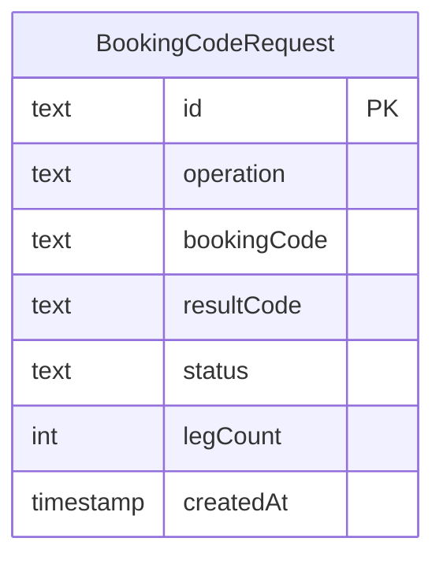

# Data model

One table: a log of every decode/create/convert request the backend has handled. No user
accounts, no cached slip data — slips are always re-fetched live from Betway.

Generated via `.claude/skills/prisma-postgres-history/scripts/erd_generator.py` against a
`prisma migrate diff` DDL dump of `prisma/schema.prisma`. A single-entity diagram is the
correct output here, not an incomplete one — see that skill's SKILL.md.

- `operation`: `"resolve" | "create" | "convert"`
- `bookingCode`: input code for resolve/convert; output code for create
- `resultCode`: the new code produced by convert (null for resolve/create)
- `status`: `"ok" | "invalid_code" | "conflicting_selections" | "upstream_error"`
