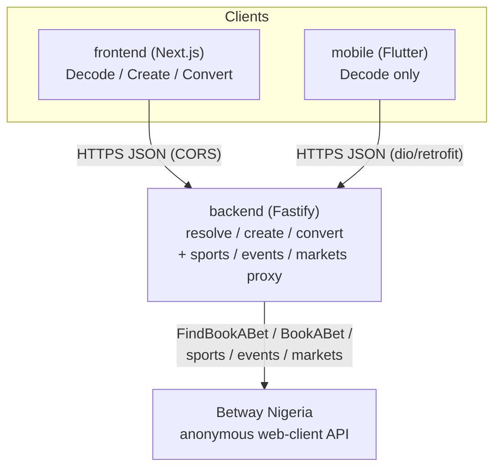
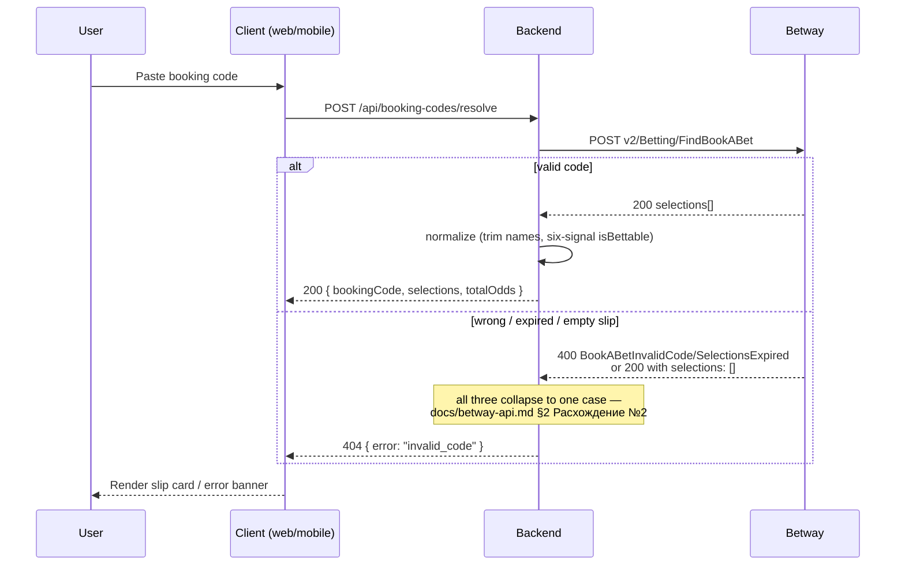
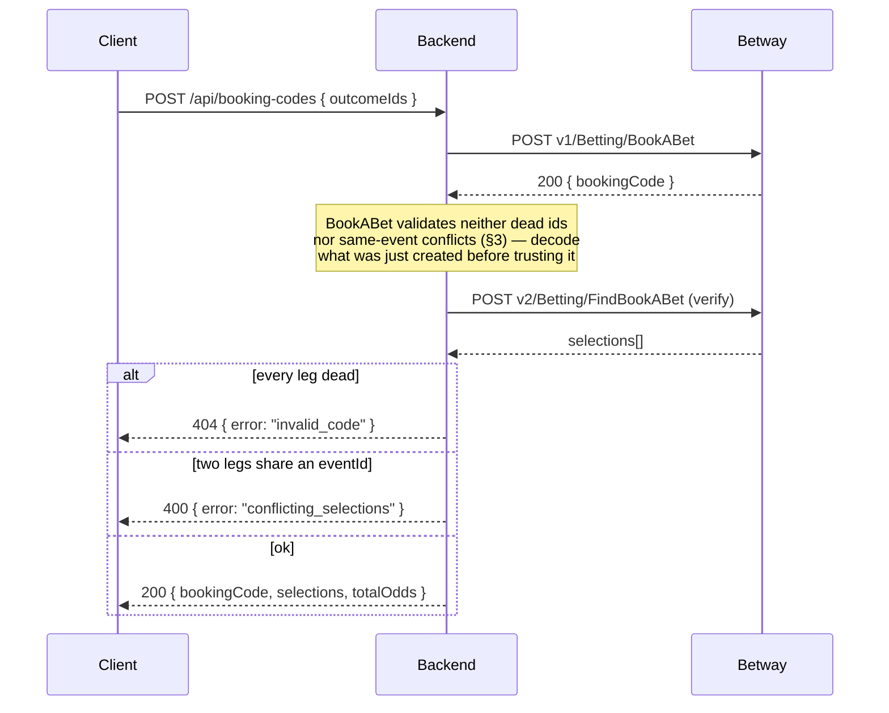
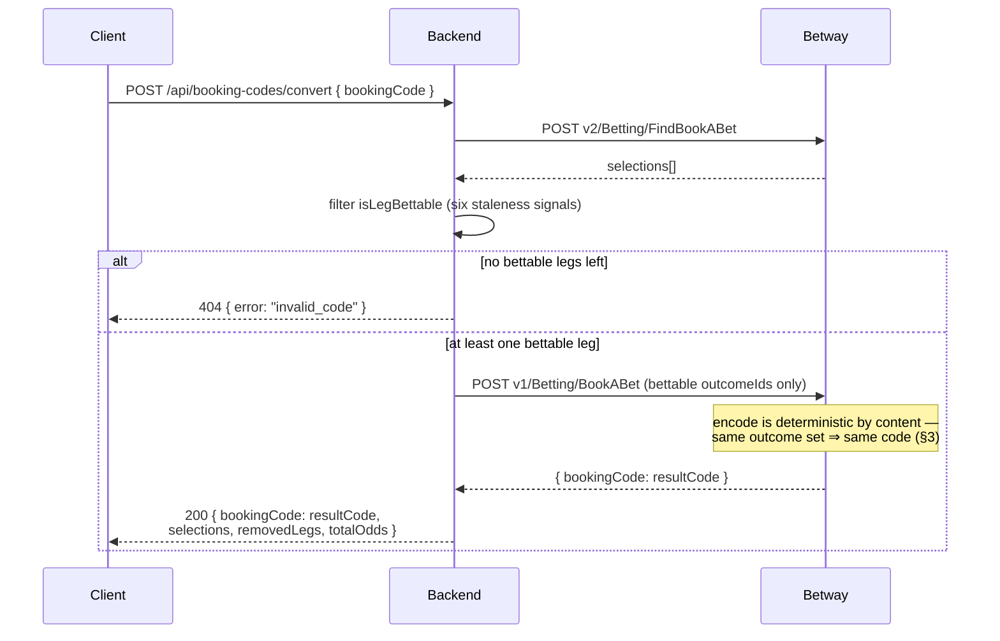

# Architecture — Betway Nigeria booking-code product

Three independently deployable repos: `backend` (this one — Node.js/TypeScript, Fastify),
`frontend` (Next.js), `mobile` (Flutter). Neither client ever calls Betway directly —
everything goes through this backend, which is the only thing that talks to Betway's
anonymous, unofficial API (`docs/betway-api.md`).

## System overview

Why this shape:
- **One backend, two clients.** Web and mobile share one contract (`docs/betway-api.md`
  §10) instead of each reverse-engineering Betway independently — CORS only matters for
  the browser client (`src/app.ts`'s `CORS_ORIGIN`), Dio on mobile isn't subject to it.
- **No database.** Every slip is decoded live from Betway on each request; there's no user
  data or state worth persisting, so there's nothing a database would do here beyond
  logging requests nobody reads — the take-home only asks for one "if required".
- **Mobile is Decode-only** — the take-home explicitly allows "a rough one-screen version"
  for the Flutter delivery.

## Decode flow

## Create (encode) flow

## Convert flow

