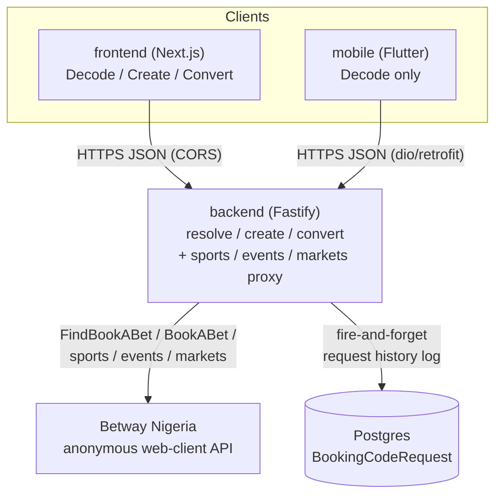
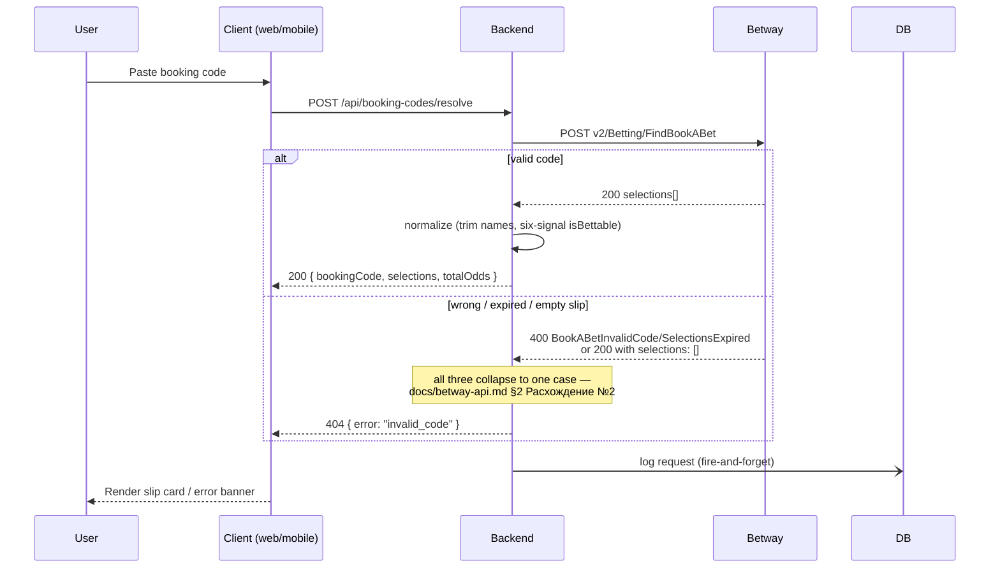
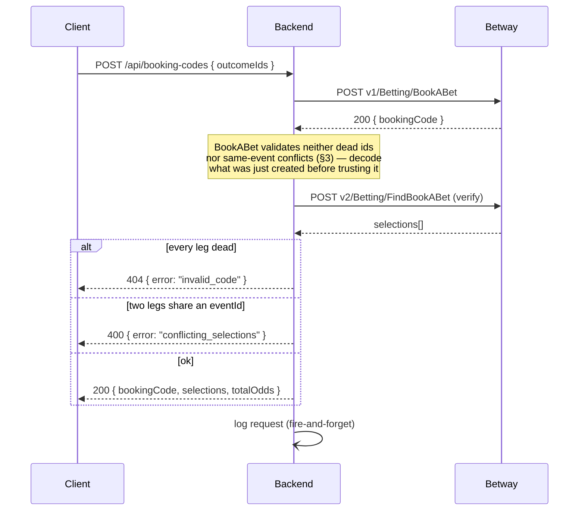
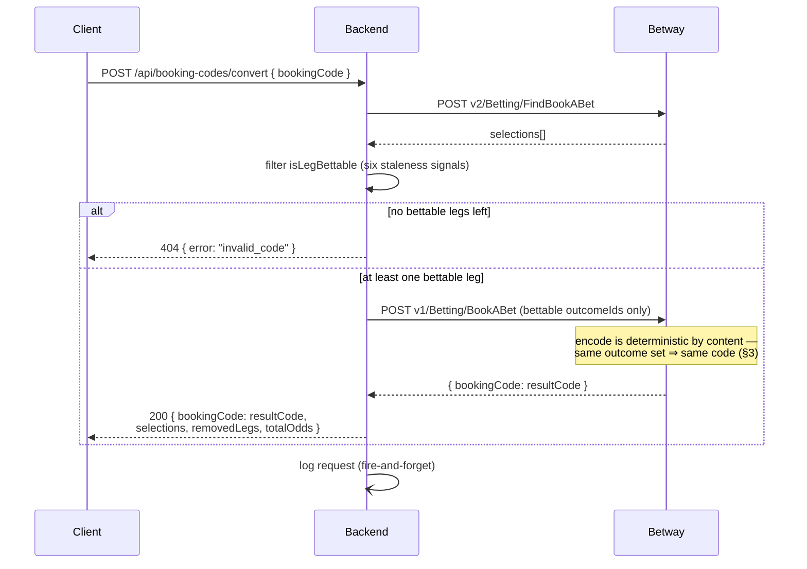
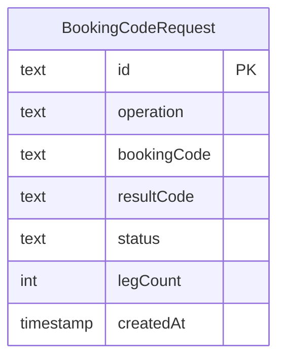

# Architecture — Betway Nigeria booking-code product

Three independently deployable repos: `backend` (this one — Node.js/TypeScript, Fastify),
`frontend` (Next.js), `mobile` (Flutter). Neither client ever calls Betway directly —
everything goes through this backend, which is the only thing that talks to Betway's
anonymous, unofficial API (`docs/betway-api.md`).

## System overview

Why this shape:
- **One backend, two clients.** Web and mobile share one contract (`docs/betway-api.md`
  §10) instead of each reverse-engineering Betway independently — CORS only matters for
  the browser client (`src/app.ts`'s `CORS_ORIGIN`), Dio on mobile isn't subject to it.
- **History logging is fire-and-forget** (`src/db/logRequest.ts`) — a DB hiccup can never
  turn an otherwise-successful Betway round trip into a 500, and it doesn't add a blocking
  round trip to the response path.
- **Mobile is Decode-only** — the take-home explicitly allows "a rough one-screen version"
  for the Flutter delivery.

## Decode flow

## Create (encode) flow

## Convert flow

## Data model

One table: a log of every decode/create/convert request the backend has handled. No user
accounts, no cached slip data — slips are always re-fetched live from Betway.

Generated via `.claude/skills/prisma-postgres-history/scripts/erd_generator.py` against a
`prisma migrate diff` DDL dump of `prisma/schema.prisma`. A single-entity diagram is the
correct output here, not an incomplete one — see that skill's SKILL.md.

- `operation`: `"resolve" | "create" | "convert"`
- `bookingCode`: input code for resolve/convert; output code for create
- `resultCode`: the new code produced by convert (null for resolve/create)
- `status`: `"ok" | "invalid_code" | "conflicting_selections" | "upstream_error"`
